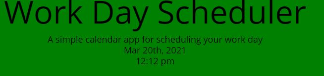

# 05-work-day-scheduler

I made this workday schduler for a workday i am used to
8AM - 5Pm

started off with the html which i made into diverent time blocks with indivudial classes and id's

```
section class='row' id='1p'>
            <div class='col-1 justify-content-left teal'>
                <p>1:00 pm</p>
            </div>
            <textarea class='col-10 justify-content-center' id='text1p' placeholder="What to do for the day"></textarea>
            <button class='col-1 justify-content-right' id='btn1p'>Save</button>
        </section>

```

gave them all a class of row for the section and than spaced them out with the col-1, col-10 to give them correct spacing for the conetent.

next step was working on the java script

first step for me was getting the time and date up on the header.



i accomplished this by the following code

```
var todayDate = moment().format('MMM Do, YYYY')
var todayTime = moment().format('h:mm:ss a')

$('#currentDay').text(todayDate);
$("#currentTime").text(todayTime);
```

which set the time but i kept running into the trouble of the time not currently counting, and only updating on reload. so i had to add a counter kind of like a time looking like

```
$(document).ready(function() {
    datetime = $('#currentTime')
    update();
    setInterval(update, 1000);
});
```

which let the time start counting.

next step was setting the background color for the future, present, and past times

we accomplished this by first setting the if statements based on what time it is.

```
var now = new Date().getHours();

if (now > 8) {
        $("#8a").addClass("past");
    } else if (now >= 8 && now < 9) {
        $("#8a").addClass("present");
    } else if (now < 8) {
        $("#8a").addClass("future");
    }
```

we did this for each time slot avaliable.

which basically says that if the hour is past 8 add a past class which made the background a certain color.

if its grater than or equal to 8 and less than 9
than it will have the class of present.
else less than 8 will have the class of furture
depending on the time that is given fron the now variable

once we got on of these completed it was easy to make the rest of them just had to copy and paste the if statmenet 10 times and change the hours in military time counting upwards.

than we went onto the save buttons

```
function eightA() {
    var input_textarea = document.querySelector("#text8a");
    var output_div = document.querySelector("#text8a");
    var save_button = document.querySelector("#btn8a");

    save_button.addEventListener("click", updateOutput);

    output_div.textContent = localStorage.getItem("content1");
    input_textarea.value = localStorage.getItem("content1");

    function updateOutput() {
        localStorage.setItem("content1", input_textarea.value);
        output_div.textContent = input_textarea.value;
    }
}
```

the issue i went into the save button was delcaring the content we were saving it as in local storage..
so i had to number then from 1-10 for each hour to have their own storrage

all of this led to the fully functional page that we see here


